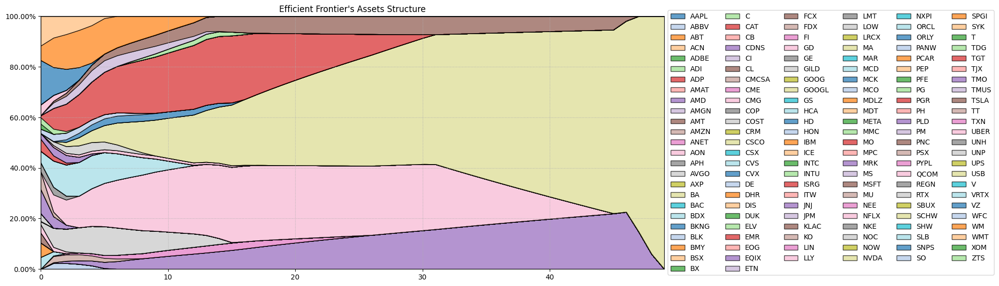

# Stochastic Finance Risk Modeling Project

**Team Members:**
- Hugo Jupin
- Chahine Nejma
- Yecine Ktari
- Julius Graf
- Edward Lucyszyn

## Project Overview

This project was completed as part of the **ST7: Modélisation Des Risques Financiers** course at CentraleSupélec, under the guidance of **BNP Paribas Asset Management's Quant Research Group**. The aim was to develop an optimal financial portfolio using stochastic modeling techniques. The project was conducted over a period of two months, from February to April 2024.

### Objective
The goal of this project was to create and optimize an investment portfolio using financial data, while assessing performance and risk through various methods. We worked with a dataset derived from **Yahoo Finance**, focusing on the 150 most significant assets within the **S&P 500**. The project involved the use of advanced optimization algorithms and risk measures, as outlined below.

### Methodology
1. **Portfolio Optimization**:  
   We applied **Markowitz's portfolio theory** to maximize return and minimize risk, accounting for variance, covariance, and transaction costs.
   
2. **Risk Management**:  
   We assessed different risk measures, including **Expected Shortfall (ES)** and **Entropic Value at Risk (EVaR)**, to quantify potential losses in extreme market conditions.

3. **Transaction Costs**:  
   A soft constraint on transaction costs was integrated into our optimization model to evaluate its impact on portfolio performance.

### Key Findings
- **Markowitz Portfolio Optimization** yielded significant improvements in risk-adjusted returns compared to simpler models.
- Risk measures such as **CVaR** and **EVaR** provided deeper insights into portfolio performance under extreme conditions.
- The inclusion of transaction costs proved crucial in refining portfolio allocations, as it balanced returns against the impact of frequent trading.

### Code Overview
A good portion of the code for generating figures and performing the Markowitz optimization is available in the **`markowitz.ipynb`** notebook. However, some files required for full execution (e.g., datasets and auxiliary scripts) are missing from this repository. As a result, users might encounter issues when trying to run the notebook in its entirety.

## Repository Structure
- **Report**:  
  The final project report, [report.pdf](report.pdf), details our data analysis, methodology, results, and conclusions.
  
- **Project Instructions**:  
  The original instructions document [project_instructions.pdf](project_instructions.pdf) contains the full project guidelines and evaluation criteria.
  
- **Exercises (TD)**:  
  Two practical exercises (TD1, TD2) relevant to the project are partially included in their respective folders.

## Tools and Technologies
- **Python** (for data manipulation and model development)
- **Riskfolio-Lib** (for risk and portfolio optimization)
- **LaTeX** (for report writing)

## Conclusion & Perspectives
Our analysis demonstrated that risk management plays a pivotal role in optimizing investment strategies, especially when market conditions become turbulent. Future work could explore more robust models to further enhance performance in volatile markets.